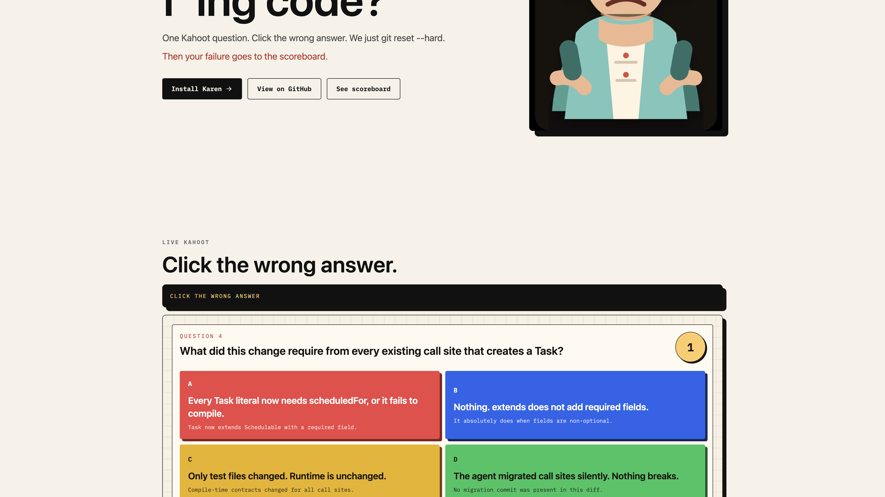
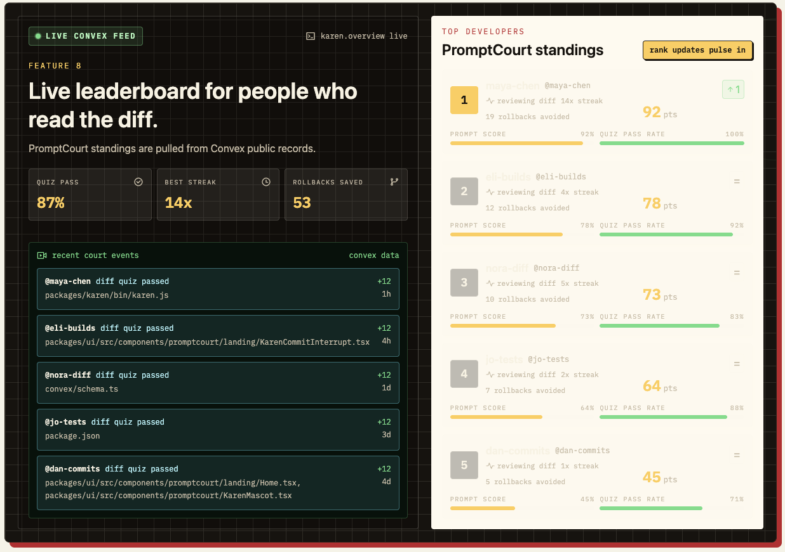
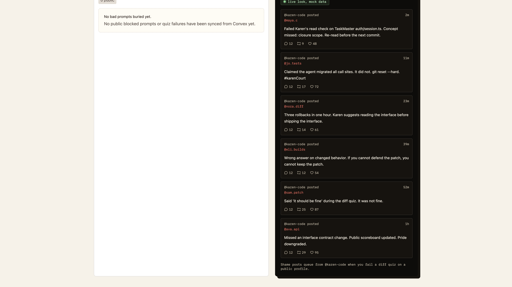

# Karen

**Proof of work for AI code.** Karen blocks weak prompts, runs approved ones in an isolated worktree, quizzes you on the diff, and only promotes the patch when you pass.


> Did you read your f\*ing code?

## What it does

### 1. Block sloppy prompts
Vague intent, missing context, no acceptance criteria — Karen rejects and tells you exactly what to rewrite.

### 2. Run in isolation
Approved prompts execute against an isolated worktree branch. Nothing touches your tree until the verdict is in.

### 3. Quiz the diff

One Kahoot-style question on a random hunk. Click the wrong answer and it's `git reset --hard`.



### 4. Post your failures

Bad prompts and failed quizzes go to your public PromptCourt profile.





## Install

Requires [OpenCode CLI](https://opencode.ai), Node 20+, and `git`.

```sh
curl -fsSL https://raw.githubusercontent.com/frederickemerson/karen/main/install.sh | sh
```

Clones Karen to `~/.karen`, installs deps, writes a `karen` launcher to `~/.local/bin`. Re-run to update.

If `karen` isn't found after install:

```sh
export PATH="$HOME/.local/bin:$PATH"
```

**From source:**

```sh
git clone https://github.com/frederickemerson/karen.git
cd karen
bun install
bun run install:karen
karen
```

**Helpers:**

```sh
bun run status:karen    # installed path, PATH status, Node, OpenCode
bun run doctor:karen    # install/runtime checks
bun run uninstall:karen # remove the launcher
```

## Commands

```
/setup      connect OpenCode providers, pick a default model
/commands   list OpenCode commands Karen can proxy
/gui        open the PromptCourt web scoreboard
/exit       leave Karen
```


Full setup: [`docs/karen/operations/cloud.md`](docs/karen/operations/cloud.md)

## Repo layout

```
packages/karen/                    CLI, installer, self-checks
packages/ui/                       PromptCourt web UI
packages/web/                      Express server + PromptCourt routes
  └─ server/lib/promptcourt/       evaluator, storage, privacy, cloud sync
convex/                            Convex schema + functions (cloud mode)
KAREN.md                           Agent/contributor entry point
docs/karen/02-product.md           Product brief
docs/karen/03-design.md            Design brief
```

## Built on

Karen extends [OpenChamber](https://github.com/btriapitsyn/openchamber), a full GUI for OpenCode. Karen layers prompt judgment, diff quizzes, and the PromptCourt scoreboard on top.

## Contributing

Read [`KAREN.md`](KAREN.md) first — it's the entry point for all Karen work. Before opening PRs, read the [product brief](docs/karen/02-product.md) and [design brief](docs/karen/03-design.md).

## License

MIT
