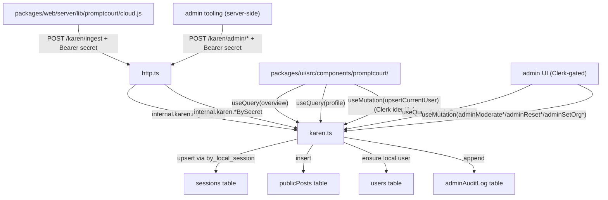

# Karen Convex

Karen's optional cloud layer. Convex stores users, sessions, public posts, rewards, and org settings; exposes queries and mutations consumed by the PromptCourt UI; and accepts ingested events from the PromptCourt server. Karen runs local-first; this surface is engaged only when `KAREN_CLOUD_SYNC=1` and a Convex deployment is configured.

## Agent TL;DR

- Four hand-edited TypeScript files: [`schema.ts`](schema.ts) (tables + indexes), [`karen.ts`](karen.ts) (queries, mutations, ingest, admin moderation), [`http.ts`](http.ts) (HTTP actions), [`auth.config.ts`](auth.config.ts) (Clerk JWT). Anything under `_generated/` is produced by Convex; do not hand-edit.
- Two trust boundaries:
  - `Authorization: Bearer <KAREN_CLOUD_INGEST_SECRET>` for ingest and the admin HTTP actions (`/karen/admin/cleanup`, `/karen/admin/moderate-post`, `/karen/admin/moderate-user`, `/karen/admin/reset-user`, `/karen/admin/org-settings`).
  - Clerk JWT identity for end-user and admin Convex mutations (`upsertCurrentUser`, `adminCleanupDevRecords`, `adminModeratePublicPost`, `adminModerateUser`, `adminResetUserData`, `adminSetOrgSettings`); admin mutations additionally require the Clerk subject to appear in `KAREN_ADMIN_USER_IDS`.
- Ingestion is idempotent. The server passes `localSessionId` (and `opencodeSessionId` when known); `ingestEvent` upserts via the `by_local_session` / `by_opencode_session` indexes.
- Set `CLERK_JWT_ISSUER_DOMAIN` in the Convex deployment env. Set `KAREN_CLOUD_INGEST_SECRET` in both `.env.local` and the Convex deployment env to the same value.

## Purpose

Make Karen's records public, queryable, and durable beyond a single developer machine. The cloud layer is what powers the public scoreboard, leaderboard, org-mode policy, and cross-device profile views. None of it is required for the agent flow to work.

## Files

- [`schema.ts`](schema.ts) - table definitions and indexes. Tables: `users` (Clerk identity binding, role, status, moderation metadata), `sessions` (with `privacyMode`, `source`, moderation fields, and indexes on user, local session id, opencode session id, createdAt, moderation, privacy), `publicPosts` (visibility + moderation status, redaction summary, report count), `rewards` (with revocation metadata), `orgSettings` (org-wide policy: privacy mode, secret-scanning, public-posting, moderation mode, leaderboard policy), and `adminAuditLog` (append-only record of admin actions).
- [`karen.ts`](karen.ts) - public queries (`overview`, `profile`, `adminOverview`), public mutations (`upsertCurrentUser`, `adminCleanupDevRecords`, `adminModeratePublicPost`, `adminModerateUser`, `adminResetUserData`, `adminSetOrgSettings`), and internal mutations (`ingestEvent`, `cleanupDevRecordsBySecret`, `moderatePublicPostBySecret`, `moderateUserBySecret`, `resetUserDataBySecret`, `setOrgSettingsBySecret`). Computes profile stats, leaderboard, and rewards in `computeProfile`. Username normalization, Clerk-admin gating (`KAREN_ADMIN_USER_IDS`), and audit-log writes live here.
- [`http.ts`](http.ts) - HTTP routes mounted by `httpRouter()`: `GET /karen/health`, `POST /karen/ingest`, `POST /karen/admin/cleanup`, `POST /karen/admin/moderate-post`, `POST /karen/admin/moderate-user`, `POST /karen/admin/reset-user`, `POST /karen/admin/org-settings`. All non-health routes go through `authorizeIngest` and call into the matching `internal.karen.*BySecret` mutation.
- [`auth.config.ts`](auth.config.ts) - exports the Convex `AuthConfig`. Adds a Clerk JWT provider when `CLERK_JWT_ISSUER_DOMAIN` is set, otherwise no providers (Convex queries that require identity will fail explicitly).

Excluded from this module by convention: everything under `_generated/` (regenerated by `bun run convex:dev`/`deploy`), and `README.md`.

## Contract

HTTP surface (defined in [`http.ts`](http.ts)):

| Method | Path | Auth | Purpose |
|---|---|---|---|
| GET | `/karen/health` | none | Liveness check. Returns `{ ok: true, service: 'karen-convex' }`. |
| POST | `/karen/ingest` | `Bearer <KAREN_CLOUD_INGEST_SECRET>` | Upserts a session and optionally a public post. Body shape matches [`packages/web/server/lib/promptcourt/cloud.js`](../packages/web/server/lib/promptcourt/cloud.js) `sessionPayload` + `publicPostPayload`, wrapped in `{ kind, session, publicPost }`. |
| POST | `/karen/admin/cleanup` | `Bearer <KAREN_CLOUD_INGEST_SECRET>` | Runs `cleanupDevRecordsBySecret` with `mode = 'smoke'` (default) or `'all'`. |
| POST | `/karen/admin/moderate-post` | `Bearer <KAREN_CLOUD_INGEST_SECRET>` | Sets `moderationStatus` / `visibility` (and reason) on a `publicPosts` row. |
| POST | `/karen/admin/moderate-user` | `Bearer <KAREN_CLOUD_INGEST_SECRET>` | Sets a user's `status` and/or `publicProfileEnabled`, with optional reason. |
| POST | `/karen/admin/reset-user` | `Bearer <KAREN_CLOUD_INGEST_SECRET>` | Resets a user's records by `mode` (e.g. `smoke` / `all`). |
| POST | `/karen/admin/org-settings` | `Bearer <KAREN_CLOUD_INGEST_SECRET>` | Upserts the org's `mode`, `secretScanningEnabled`, `publicPostingEnabled`, `requireClerkForPublicProfiles`, `allowLocalUsersOnLeaderboard`, `moderationMode`. |

Convex client surface (defined in [`karen.ts`](karen.ts)):

| Kind | Name | Auth | Purpose |
|---|---|---|---|
| query | `overview` | none | Leaderboard, totals, feed, all profiles. |
| query | `profile` | none | Single profile with stats, recent sessions, public posts. |
| query | `adminOverview` | Clerk identity in `KAREN_ADMIN_USER_IDS` | Admin dashboard view: users, recent sessions/posts, org settings, audit log. |
| mutation | `upsertCurrentUser` | Clerk identity required | Binds the Clerk subject to a username. |
| mutation | `adminCleanupDevRecords` | Clerk identity in `KAREN_ADMIN_USER_IDS` | Smoke or full dev-record cleanup. |
| mutation | `adminModeratePublicPost` | Clerk identity in `KAREN_ADMIN_USER_IDS` | Hide / restore / soft-delete a public post; writes an audit-log entry. |
| mutation | `adminModerateUser` | Clerk identity in `KAREN_ADMIN_USER_IDS` | Suspend / restore a user; toggle public profile; writes an audit-log entry. |
| mutation | `adminResetUserData` | Clerk identity in `KAREN_ADMIN_USER_IDS` | Reset a user's records (`smoke` / `all`); writes an audit-log entry. |
| mutation | `adminSetOrgSettings` | Clerk identity in `KAREN_ADMIN_USER_IDS` | Upserts an org's policy row in `orgSettings`; writes an audit-log entry. |
| internal mutation | `ingestEvent` | called only via `/karen/ingest` HTTP action | Upserts session + optional public post. |
| internal mutation | `cleanupDevRecordsBySecret` | called only via `/karen/admin/cleanup` | Bypasses Clerk; relies on the ingest-secret HTTP boundary. |
| internal mutation | `moderatePublicPostBySecret` | called only via `/karen/admin/moderate-post` | Secret-bypass mirror of `adminModeratePublicPost`. |
| internal mutation | `moderateUserBySecret` | called only via `/karen/admin/moderate-user` | Secret-bypass mirror of `adminModerateUser`. |
| internal mutation | `resetUserDataBySecret` | called only via `/karen/admin/reset-user` | Secret-bypass mirror of `adminResetUserData`. |
| internal mutation | `setOrgSettingsBySecret` | called only via `/karen/admin/org-settings` | Secret-bypass mirror of `adminSetOrgSettings`. |

`auth.config.ts` exports the Clerk JWT provider so Convex can validate Clerk-issued JWTs sent from the UI.

## Data flow



## Invariants

- **Two trust boundaries, not one.** Ingest and `/karen/admin/*` HTTP actions trust `KAREN_CLOUD_INGEST_SECRET`. Convex mutations called from the UI trust Clerk JWTs (and, for admin mutations, additionally require the Clerk subject to be in `KAREN_ADMIN_USER_IDS`). Do not collapse them.
- **Every admin path appends to the audit log.** Both the Clerk-gated admin mutations and their `*BySecret` mirrors must `append` to `adminAuditLog` so moderation actions are reconstructable. Do not add a moderation path that bypasses the audit log.
- **Ingest is idempotent.** `ingestEvent` upserts by `localSessionId` first, then `opencodeSessionId`. Re-sending the same event does not create duplicates.
- **Username is normalized server-side.** The same `normalizeUsername` rules live in [`packages/web/server/lib/promptcourt/storage.js`](../packages/web/server/lib/promptcourt/storage.js); they must stay in sync.
- **No PII in `publicPosts`.** The server redacts before sending; Convex stores what arrives. Do not add a redaction step here, but reject obviously raw values if you spot the chance.
- **`auth.config.ts` is silent when Clerk is not configured.** Returning an empty providers list lets the deployment exist without auth-bound mutations succeeding. Do not throw at deploy time.
- **Schema migrations are deliberate.** Adding indexes is fine; renaming/removing columns must be staged across server, UI, and ingest payloads.
- **Moderation and visibility live on the row.** `sessions.privacyMode`, `publicPosts.visibility`, `*.moderationStatus` are the source of truth. The UI must filter by these fields, not by absence-of-content heuristics.

## Change rules

- All schema changes go in [`schema.ts`](schema.ts) and require a parallel update to [`karen.ts`](karen.ts) (`sessionValidator`, `publicPostValidator`, `ingestEvent` patch shape) and [`packages/web/server/lib/promptcourt/cloud.js`](../packages/web/server/lib/promptcourt/cloud.js) (`sessionPayload`, `publicPostPayload`).
- New HTTP actions belong in [`http.ts`](http.ts), guarded by `authorizeIngest`.
- New admin actions must come in matched pairs: a Clerk-gated public mutation (`adminFoo`) plus a secret-gated `internalMutation` (`fooBySecret`) wired through a `/karen/admin/*` HTTP route. Both branches must call the same audit-log append helper.
- New Convex queries that the UI consumes must keep query shapes additive when possible. Removing a returned field is a breaking change for [`../packages/ui/src/components/promptcourt/`](../packages/ui/src/components/promptcourt/).
- New environment variables must be documented in [`../docs/karen/operations/env.md`](../docs/karen/operations/env.md). Cloud setup steps live in [`../docs/karen/operations/cloud.md`](../docs/karen/operations/cloud.md).
- Do not call out to external services from inside Convex functions without an explicit decision record. Convex functions run server-side; outbound HTTP introduces latency and trust questions.
- The `_generated/` directory is regenerated by Convex tooling. Never hand-edit and never reference its files in this `Files` section.

## Tests

This module has no in-tree tests. Coverage comes from:

- [`../packages/web/server/lib/promptcourt/cloud.test.js`](../packages/web/server/lib/promptcourt/cloud.test.js) - asserts the server-to-Convex ingest contract (endpoint, headers, payload shape).
- [`../packages/web/server/lib/promptcourt/routes.test.js`](../packages/web/server/lib/promptcourt/routes.test.js) - exercises the server side of the ingest path.
- The Playwright GUI smoke (`bun run test:karen-gui`) covers Convex-backed UI rendering when a deployment is configured.

For a real-deployment smoke test, hit `https://<deployment>.convex.site/karen/health` from a developer machine and run:

```sh
bun run convex:dev -- --once
bun run test:promptcourt
```
