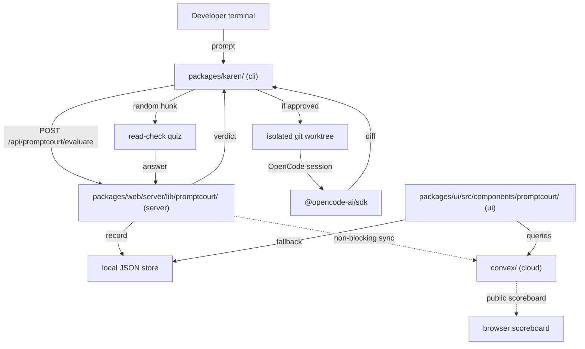

# Karen Architecture

The end-to-end shape of Karen across its four surfaces. This document is a structural overview, not a per-module reference. For per-module detail, read each surface's `DOCUMENTATION.md` (see module map in [`KAREN.md`](../../KAREN.md)).

## Agent TL;DR

- Karen has four surfaces: `cli` (terminal), `server` (PromptCourt routes inside the OpenChamber web server), `ui` (PromptCourt scoreboard inside the OpenChamber web UI), `cloud` (Convex + Clerk).
- The CLI is the product. The web UI is the scoreboard. The server is the policy boundary. The cloud is the public ledger.
- Local recording is authoritative. Cloud sync is best-effort and non-blocking.
- A prompt's lifecycle is: `compose -> evaluate (verdict) -> isolate (worktree) -> execute (OpenCode) -> read-check (quiz) -> promote or throw out -> record`.

## Architecture diagram

## In scope

Karen's runtime architecture covers:

- The lifecycle of a prompt from terminal capture through verdict, execution, read-check, and recording.
- The data ownership boundary between local JSON storage and Convex cloud storage.
- The interaction between Karen's PromptCourt server and the inherited OpenChamber Express server (mount point only; routes are Karen).
- The interaction between Karen's PromptCourt UI and the inherited OpenChamber web app shell (mount point only; components are Karen).

Inherited components Karen depends on:

- Express server bootstrap in `packages/web/server/index.js` (Karen mounts `/api/promptcourt/*` routes here).
- React app shell in `packages/web/src/main.tsx` (Karen mounts the PromptCourt page here).
- OpenCode SDK client in `packages/ui/src/lib/opencode/client.ts`.
- Theme and typography tokens in `packages/ui/src/lib/theme/` and `packages/ui/src/lib/typography.ts` (Karen colors layer on top per [03-design.md](03-design.md)).

## Out of scope

This document does not describe:

- Internal architecture of any inherited OpenChamber module. For those, read inherited module docs listed in [`AGENTS.md`](../../AGENTS.md) Inherited documentation map.
- The OpenCode server itself. It is treated as an external dependency.
- The Electron, Tauri, or VS Code shells. Karen does not target them today.

## How to add a new surface

When the architecture needs a new surface:

1. Sketch where the surface fits in the diagram above. Document the call edges (who calls it, what it calls).
2. Open a [decision record](decisions/) explaining the new surface and its data flow.
3. Follow the `How to add a new surface` steps in [`00-scope.md`](00-scope.md).
4. Update the mermaid diagram in this file in the same change.

## Invariants worth remembering

- **Local first.** The local JSON store is authoritative. Cloud is derived state.
- **Verdicts come from the server, not the CLI.** The CLI sends the prompt; the server returns the verdict. The CLI never invents a verdict.
- **Privacy redaction runs on the server before any storage write.** UI redaction is presentation only.
- **Worktree isolation holds across the full execution.** Patches do not touch the user's tree until the read-check passes.
- **Cloud failures never stall the agent flow.** Sync is fire-and-forget with a retry queue.
