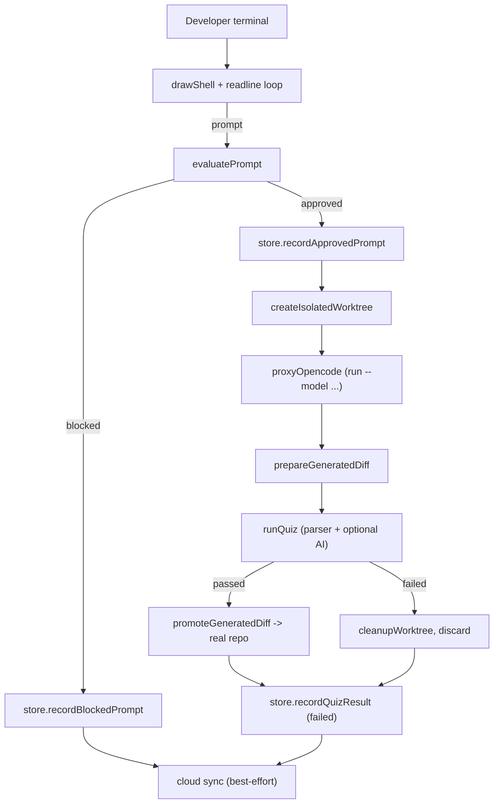

# Karen CLI

The terminal judgment layer for OpenCode. This is the product. Karen runs in a developer's terminal, intercepts prompts, evaluates them through PromptCourt, executes approved ones in an isolated git worktree against OpenCode, quizzes the developer on the resulting diff, and only promotes the patch into the real repo when the read-check passes.

## Agent TL;DR

- One file does most of the work: [`bin/karen.js`](bin/karen.js). Keep it focused on terminal UX, OpenCode passthrough, worktree orchestration, and quiz flow.
- Prompt evaluation, storage, and privacy redaction live in [`../web/server/lib/promptcourt/`](../web/server/lib/promptcourt/) and are imported directly. Do not duplicate them here.
- Worktree isolation and patch promotion are non-negotiable. The self-check in [`self-check/worktree-safe.mjs`](self-check/worktree-safe.mjs) protects this contract.
- The installer and the `karen` launcher live in [`scripts/install-karen.mjs`](../../scripts/install-karen.mjs). For installer behavior, read [`docs/karen/operations/install.md`](../../docs/karen/operations/install.md).
- Audio is opt-out via `KAREN_AUDIO=0`. ElevenLabs and AI quizzes degrade gracefully when API keys are missing.

## Purpose

Make the agent loop feel like a courtroom: charges, verdict, sentence, appeal, read check. The CLI is the only place a developer actually runs Karen on real code. Everything in the web UI ([`../ui/src/components/promptcourt/`](../ui/src/components/promptcourt/)) is a scoreboard derived from CLI activity.

## Files

- [`bin/karen.js`](bin/karen.js) - main CLI entrypoint. Renders the shell, runs the setup wizard, dispatches `/commands`, intercepts terminal-typed prompts, runs the prompt-evaluate -> worktree -> OpenCode -> quiz -> promote loop, plays audio cues, generates parser- and AI-backed quizzes.
- [`self-check/worktree-safe.mjs`](self-check/worktree-safe.mjs) - end-to-end self-check for the worktree isolation contract. Creates a temp git repo, simulates failed and passed runs, and asserts that failed runs cannot leak files into the real repo and that passed runs promote correctly.
- [`self-check/cli-and-installer.mjs`](self-check/cli-and-installer.mjs) - asserts `karen --help` exposes documented commands, and that the installer can install, report status, and uninstall using a temp directory.

The bundled launcher and assets are not tracked source files (they are generated or static):

- `bin/karen.js` is also referenced by the installer wrapper written by [`scripts/install-karen.mjs`](../../scripts/install-karen.mjs).
- `assets/terminal-banner.txt` is a static text asset.
- `package.json` and `README.md` are package manifests, not module logic.

## Contract

Public CLI surface:

- `karen` - opens the interactive Karen shell.
- `karen "<prompt>"` - judges and runs one prompt, then drops into the shell.
- `karen --help` / `-h` - prints usage and the command list.
- `karen --version` / `-v` - prints the package version from [`package.json`](package.json).

Inside the shell, slash commands include `/help`, `/setup`, `/gui`, `/tui`, `/tui-raw`, `/run`, `/providers`, `/models`, `/auth`, `/mcp`, `/agent`, `/session`, `/stats`, `/audio`, `/feed`, `/profile`, `/diff`, `/opencode ...`, and `/quit`. The full list is enumerated in `printHelp` and `printOpenCodeCommands` in [`bin/karen.js`](bin/karen.js).

Imports from sibling Karen surfaces:

- `evaluatePrompt` from `../../web/server/lib/promptcourt/evaluator.js`.
- `redactPublicText` from `../../web/server/lib/promptcourt/privacy.js`.
- `createPromptCourtStore` from `../../web/server/lib/promptcourt/storage.js` (which wires in the cloud sync from `cloud.js`).

External binaries the CLI shells out to: `git`, `node`, `node-pty`, `opencode` (resolved by `resolveOpencodeBinary`), and platform-specific audio tools (`afplay`, `say`, `osascript`, `spd-say`, `powershell`).

## Data flow



The TUI passthrough mode (`/tui`) wraps OpenCode's TUI with a PTY-level interceptor (`proxyOpencodeTuiIntercept`) that watches for Enter, classifies the screen tail (`classifyTuiContext`), and runs the same evaluator before letting Enter through.

## Invariants

- **Worktree isolation.** Approved prompts execute in a temp worktree created by `createIsolatedWorktree`. Failed quizzes never touch the real repo. Tracked changes and untracked files from the real repo are mirrored into the worktree as a baseline so OpenCode sees the same state.
- **Patch promotion is atomic.** `promoteGeneratedDiff` applies the worktree diff to the real repo using `git apply`. If application fails, the patch is discarded and Karen records `executed_quiz_failed_rolled_back` even though the quiz passed.
- **Cloud is non-blocking.** Storage records locally first; cloud sync is fire-and-forget via `createPromptCourtStore`'s injected `cloudSync`. Karen prints sync errors only when `KAREN_CLOUD_DEBUG=1`.
- **Audio is opt-in for some channels.** `KAREN_AUDIO`, `KAREN_BELL`, `KAREN_MUSIC` default on; `KAREN_SAY`, `KAREN_SYSTEM_AUDIO`, `KAREN_ELEVENLABS_AUDIO` default off (last one defaults on only when `ELEVENLABS_API_KEY` is set). ElevenLabs has a daily character cap and falls back to local TTS.
- **Setup wizard runs once.** `runSetupWizard` skips when `OPENCODE_BINARY` resolves and a default model is already chosen. `KAREN_SKIP_SETUP=1` forces skip (used by self-checks and CI).
- **No prompt is judged by heuristic alone.** The evaluator is the single source of truth for verdicts. The CLI never overrides a verdict; it only renders it.

## Change rules

- Behavior changes go in [`bin/karen.js`](bin/karen.js). Avoid leaking new logic into multiple files.
- New environment toggles must be documented in [`docs/karen/operations/env.md`](../../docs/karen/operations/env.md) in the same change.
- Touching the worktree, patch promotion, or rollback paths requires updating [`self-check/worktree-safe.mjs`](self-check/worktree-safe.mjs) so the new behavior is asserted.
- Changes to slash commands or top-level help must keep [`self-check/cli-and-installer.mjs`](self-check/cli-and-installer.mjs) green (it asserts `/opencode ...` and `/providers` show up in help).
- Quiz logic exports test hooks via the `__karenTest` object at the bottom of [`bin/karen.js`](bin/karen.js). Keep the names of `analyzeDiffImpact`, `buildAiQuiz`, `buildParserQuiz`, `buildQuiz`, `classifyTuiContext`, `parseDiff`, `shouldJudgeTuiBuffer`, and `updateTuiBuffer` stable; the bin tests depend on them.
- Imports from `../../web/server/lib/promptcourt/*` are an intentional cross-surface dependency. Do not invert it (server must not import from `packages/karen/`).

## Tests

- `bin/karen.test.js` - Bun-based unit tests covering the exported `__karenTest` helpers. Run via `bun test bin/*.test.js`.
- [`self-check/worktree-safe.mjs`](self-check/worktree-safe.mjs) - end-to-end worktree isolation contract.
- [`self-check/cli-and-installer.mjs`](self-check/cli-and-installer.mjs) - end-to-end CLI help + install/status/uninstall flow.

Run all Karen CLI tests:

```sh
bun run --cwd packages/karen test
# or, from the repo root:
bun run test:karen          # self-check only
bun run test:karen-core     # promptcourt server tests + Karen self-check
bun run test:karen-gui      # Playwright GUI smoke
```
