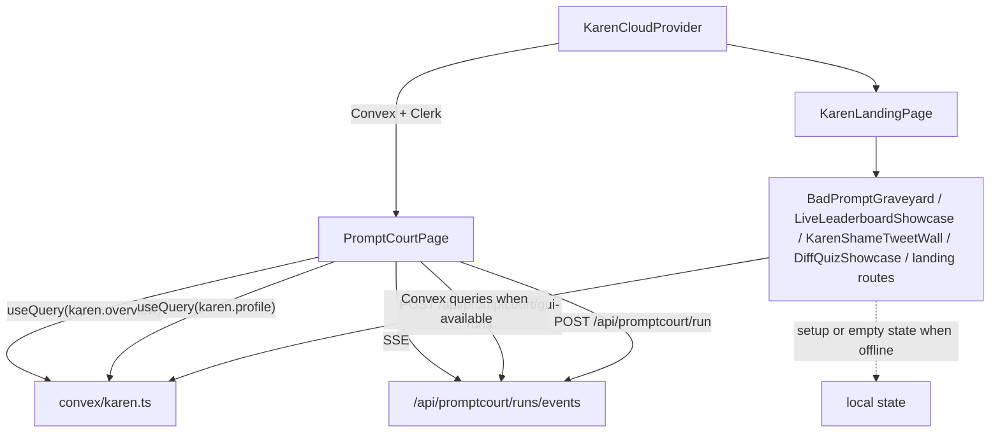

# PromptCourt UI

Karen's web scoreboard. The CLI is the product; this surface renders the public side: the bad-prompt graveyard, the leaderboard, the mock shame feed, and the live profile page. The UI is read-mostly: it queries Convex (when configured) or falls back to PromptCourt server records, never mutates verdicts.

## Agent TL;DR

- 23 components/modules. `KarenCloudProvider` wraps the tree with Convex + Clerk; `PromptCourtPage` is the live profile page; `KarenLandingPage` is the router shell for the 4-page landing flow.
- All Karen color intent comes from [`../../../../../docs/karen/03-design.md`](../../../../../docs/karen/03-design.md). Use the inherited theme tokens; do not hardcode hex values.
- Live data sources: Convex queries via `useQuery` from `convex/react`, plus the inherited `/api/promptcourt/*` HTTP routes for run streams. Never derive verdicts client-side.
- This surface inherits the OpenChamber app shell, theming, and primitives ([Base UI](https://base-ui.com/), Tailwind v4, the typography helpers in `packages/ui/src/lib/typography.ts`).
- Auth optionality: `isKarenAuthConfigured` gates Clerk-bound subcomponents so the page works without a Clerk publishable key.

## Purpose

Make Karen's records public, glanceable, and arcade-shaped. Convert PromptCourt's structured records into a scoreboard that creates social pressure for prompt discipline without leaking sensitive prompt content.

## Files

- [`PromptCourtPage.tsx`](PromptCourtPage.tsx) - the live profile page. Composes `LaunchControls`, `LiveRunStream`, `RecentSessions`, `ProfilePanel`, `BadPromptGraveyard`, `ProofProfileCard`, and the auto-mounting `KarenQuizGameModal`. Subscribes to `/api/promptcourt/runs/events` SSE for the global live run stream and, when launching a guarded run from the browser, to `/api/promptcourt/gui-runs/:runId/events` for that run's lifecycle. Auto-opens `KarenQuizGameModal` once per run when status hits `quiz_required`, including direct links such as `/karen?run=<id>`. Reads PromptCourt overview/profile data from Convex when configured and falls back to local data when not.
- [`KarenQuizGameModal.tsx`](KarenQuizGameModal.tsx) - full-screen Kahoot-style quiz overlay shown when a GUI run reaches `quiz_required`. Reads the diff and questions off the run, plays a Kahoot-inspired music loop, speaks each question through the Karen ElevenLabs TTS proxy (with browser TTS fallback), and walks the user through `intro` → `question` → `wrong`/`passed` stages. Submits answers, completion, and abandonment via `submitGuiAnswer`, `completeGuiQuiz`, and `abandonGuiQuiz` from `../../../lib/promptcourt.ts`.
- [`KarenLandingPage.tsx`](KarenLandingPage.tsx) - the public landing router shell. Renders the sticky nav and routes for `/`, `/how-it-works`, `/scoreboard`, `/install`.
- [`KarenCloudProvider.tsx`](KarenCloudProvider.tsx) - root provider. Wraps children in `ConvexProviderWithClerk` (when configured) or a no-op fallback. Reads `VITE_CONVEX_URL` and `VITE_CLERK_PUBLISHABLE_KEY`.
- [`BadPromptGraveyard.tsx`](BadPromptGraveyard.tsx) - card-grid view of blocked-prompt public posts with score-tone classes (awful, weak, appeal) and a share button that copies a redacted excerpt.
- [`KarenBadgeWall.tsx`](KarenBadgeWall.tsx) - reward badges with progress bars and initials, derived from PromptCourt rewards.
- [`CourtroomDemo.tsx`](CourtroomDemo.tsx) - scripted demo transcript of a Karen run for the landing page.
- [`DiffQuizShowcase.tsx`](DiffQuizShowcase.tsx) - mini interactive quiz preview with a countdown.
- [`LiveLeaderboardShowcase.tsx`](LiveLeaderboardShowcase.tsx) - leaderboard view backed by `getOverview` data with rank highlighting.
- [`KarenMascot.tsx`](KarenMascot.tsx) - animated Karen avatar (the courtroom ASCII face translated to vector).
- [`KarenLogo.tsx`](KarenLogo.tsx) - wordmark.
- [`ProofProfileCard.tsx`](ProofProfileCard.tsx) - single-card public profile summary, used standalone and inside the live page.
- [`DeleteOrDefend.tsx`](DeleteOrDefend.tsx) - interactive challenge mini-game where users decide to keep or roll back a generated diff under time pressure.
- [`GrandmaVoicePanel.tsx`](GrandmaVoicePanel.tsx) - settings panel for the Karen voice (mood, ElevenLabs voice id, server-side TTS proxy info, preview). Persists settings to `localStorage` under `KAREN_VOICE_STORAGE_KEY`.
- [`landing/Home.tsx`](landing/Home.tsx) - home route hero page with the confrontational pitch and mascot.
- [`landing/HowItWorks.tsx`](landing/HowItWorks.tsx) - route showing the pipeline strip, prompt judge examples, and commit-interrupt quiz.
- [`landing/Scoreboard.tsx`](landing/Scoreboard.tsx) - route combining `LiveLeaderboardShowcase`, `BadPromptGraveyard`, and `KarenShameTweetWall`.
- [`landing/Install.tsx`](landing/Install.tsx) - route with install commands and CTA.
- [`landing/KarenPipelineStrip.tsx`](landing/KarenPipelineStrip.tsx) - concise visual flow from prompt to verdict.
- [`landing/KarenCommitInterrupt.tsx`](landing/KarenCommitInterrupt.tsx) - TaskMaster commit frame and quiz handoff.
- [`landing/KarenShameTweetWall.tsx`](landing/KarenShameTweetWall.tsx) - mock `@karen-code` X-style shame feed for landing storytelling.
- [`landing/karenShameTweets.ts`](landing/karenShameTweets.ts) - deterministic mock tweet records.
- [`landing/LandingAuthCta.tsx`](landing/LandingAuthCta.tsx) - shared auth/CTA element used by the landing nav.

## Contract

Public exports:

- `KarenCloudProvider` - root provider used by the inherited app shell to gate Karen UI behind Convex + Clerk readiness.
- `PromptCourtPage` - the live profile page. Optional `username` prop; falls back to the Clerk identity when configured.
- `KarenLandingPage` - the marketing assembly.
- `BadPromptGraveyard`, `KarenBadgeWall`, `CourtroomDemo`, `DiffQuizShowcase`, `LiveLeaderboardShowcase`, `ProofProfileCard`, `DeleteOrDefend`, `GrandmaVoicePanel`, `KarenMascot`, `KarenLogo`, and `landing/*` modules - showcase components consumed by the landing and live pages.

GUI prompt behavior:

- Normal chat composer prompts still go to OpenCode after PromptCourt judgment; the dashboard guarded-run endpoint is only for explicit browser guarded-run demos.
- Commit/read-check UI must be backed by a real git diff. If the server cannot produce one, it should surface a failure state rather than opening a quiz from fixture/sample changes.
- Slash commands remain OpenCode commands; PromptCourt must not swallow `/` command autocomplete or execution.

Data sources:

- Convex queries (`convex/react`): `karen.overview`, `karen.profile`. Mutations: `karen.upsertCurrentUser` (Clerk-gated).
- Karen HTTP surface: `/api/promptcourt/runs`, `/api/promptcourt/runs/events` (SSE), `/api/promptcourt/run` (terminal launcher), and `/api/promptcourt/gui-runs` + `/api/promptcourt/gui-runs/:runId/events` (in-browser guarded runs surfaced by `PromptCourtPage`).
- `localStorage` for the Grandma voice panel settings only.

Theme tokens used: text/foreground, accent (acidic green), destructive (hot red), warning (amber), info (electric cyan). Reconcile with [`../../../../../docs/karen/03-design.md`](../../../../../docs/karen/03-design.md) and the inherited theme system.

## Data flow



`KarenCloudProvider` is the gate. When Convex/Clerk are not configured (`VITE_CONVEX_URL` or `VITE_CLERK_PUBLISHABLE_KEY` missing), the provider renders children directly and Convex-backed components must show a setup, local, or empty state instead of pretending mock records are live data.

## Invariants

- **No verdict logic in the UI.** Verdicts come from the server (`evaluatePrompt`) via Convex or HTTP. The UI may color-code verdicts but must not invent them.
- **Theme tokens only.** No raw hex values, no Tailwind palette colors. Karen colors map to inherited tokens (see [`../../../../../docs/karen/03-design.md`](../../../../../docs/karen/03-design.md)).
- **Live state vs historical state.** Live run streams come from SSE; historical sessions and posts come from Convex queries. Never let historical state masquerade as live activity.
- **Auth-optional rendering.** Every Clerk-bound feature must render gracefully when `isKarenAuthConfigured` is false. The landing page must work for an anonymous visitor.
- **Public posts are pre-redacted.** Components must not attempt to re-derive prompts from posts; they only render `promptExcerpt` and `failureReasons`.
- **Memoize heavy lists.** Leaderboard, graveyard, and badge wall are render-fanout boundaries. Use stable item keys and avoid container-level subscriptions per the inherited performance rules.

## Change rules

- New Karen UI components belong in this directory. If they need cross-surface logic, the logic lives in [`../../../../web/server/lib/promptcourt/`](../../../../web/server/lib/promptcourt/) or [`../../../../../convex/`](../../../../../convex/) and is queried, not duplicated here.
- New visual ideas must reconcile with [`../../../../../docs/karen/03-design.md`](../../../../../docs/karen/03-design.md). Color and motion changes that drift from the brief require a [decision record](../../../../../docs/karen/decisions/).
- Convex schema changes that affect UI shapes must update both [`../../../../../convex/karen.ts`](../../../../../convex/karen.ts) public views and the consuming components in the same change.
- Any new env var the UI reads must use the `VITE_` prefix and be documented in [`../../../../../docs/karen/operations/env.md`](../../../../../docs/karen/operations/env.md).
- Use Base UI primitives and the wrappers in `../ui/`. Do not pull in new UI libraries without explicit approval.
- Toasts go through the inherited wrapper from `@/components/ui`. Do not import `sonner` directly.

## Tests

There are no Karen-specific UI unit tests in this directory yet. End-to-end coverage comes from the Playwright smoke test:

```sh
bun run test:karen-gui      # tests/karen-gui.spec.ts
```

When adding interactive components (e.g., new mini-games or settings panels), add a Playwright case to the GUI smoke and reference it here.
