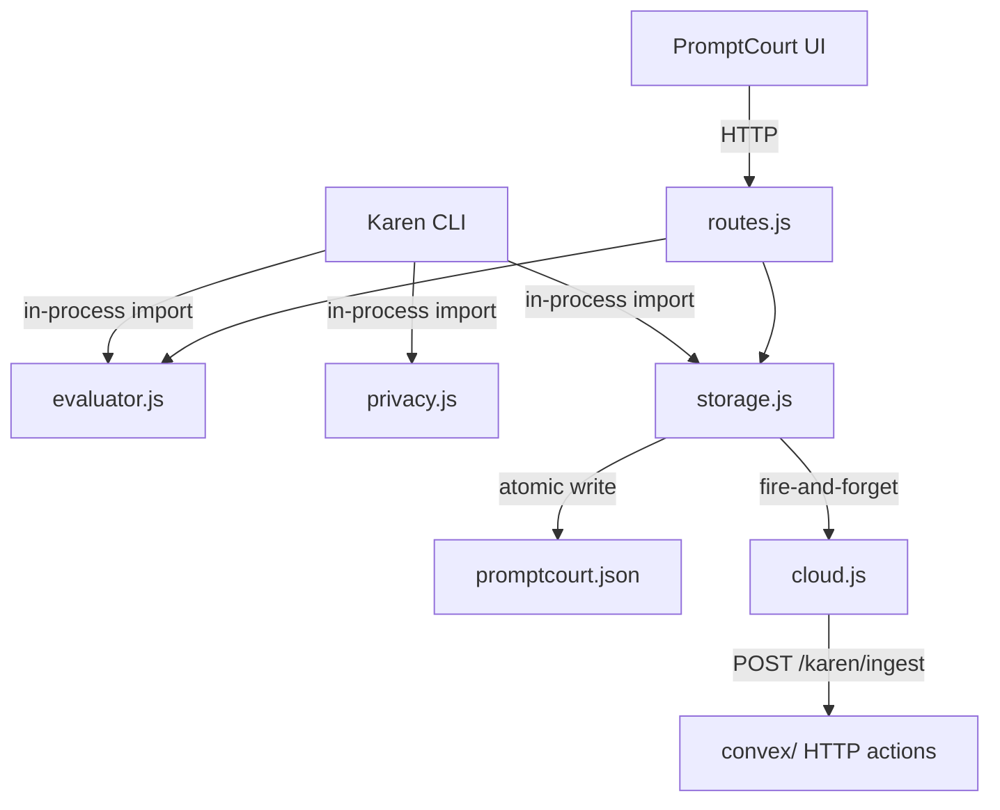

# PromptCourt Server

The server-side policy boundary for Karen. PromptCourt scores prompts, stores verdicts, redacts sensitive data, mirrors records to Convex when configured, and exposes a small HTTP surface that both the Karen CLI and the PromptCourt web UI consume.

## Agent TL;DR

- Five focused files, one responsibility each. Keep them that way.
- The evaluator is the source of truth for verdicts. Do not derive verdicts elsewhere.
- Privacy redaction in [`privacy.js`](privacy.js) runs before any value is recorded or shipped to the cloud.
- Cloud sync is fire-and-forget. Storage must succeed locally even when Convex is offline.
- Routes are mounted into the inherited Express app by [`registerPromptCourtRoutes`](routes.js); the inherited app's bootstrap calls this function. Do not couple to other Express plumbing here.

## Purpose

Encapsulate every server-side decision Karen makes about a prompt: judgment, recording, redaction, cloud mirroring, and HTTP exposure. Anything else in the OpenChamber web server is inherited substrate.

## Files

- [`evaluator.js`](evaluator.js) - prompt scoring. Exports `evaluatePrompt(prompt)` returning `{ score, verdict, allowed, reasons, dimensions, suggestedRewrite }`, plus `extractPromptText(body)` for OpenCode-shaped request bodies. Score < 70 produces `verdict='blocked'`. Reasons explain the charges.
- [`storage.js`](storage.js) - local JSON store at `$XDG_CONFIG_HOME/openchamber/promptcourt.json`. Exports `createPromptCourtStore({ openchamberDataDir, cloudSync? })` returning a store with `recordBlockedPrompt`, `recordApprovedPrompt`, `recordQuizResult`, `recordRunEvent`, `getRunEvents`, `cleanupDevRecords`, `getFeed`, `getProfile`, `getOverview`, and `normalizeUsername`. Atomic writes via temp-file rename. Computes derived profile stats (discipline score, level, streaks, rewards).
- [`privacy.js`](privacy.js) - `redactPublicText(value, maxLength)` redacts API keys, tokens, secrets, OpenAI/GitHub key shapes, emails, URLs, and `/Users/...` / `C:\Users\...` paths. Truncates with an ellipsis. Used everywhere a prompt or post excerpt crosses a boundary.
- [`cloud.js`](cloud.js) - Convex sync. Exports `createPromptCourtCloudSync({ env, fetchImpl, loadEnvFiles })` returning `{ enabled, send, recordBlockedPrompt, recordApprovedPrompt, recordQuizResult }`. Reads `KAREN_CLOUD_SYNC`, `CONVEX_HTTP_ACTIONS_URL` (and Vite/site aliases), and `KAREN_CLOUD_INGEST_SECRET`. POSTs JSON to `<endpoint>/karen/ingest` with `Authorization: Bearer <secret>`. Errors are swallowed and only logged when `KAREN_CLOUD_DEBUG=1`.
- [`routes.js`](routes.js) - HTTP surface. Exports `registerPromptCourtRoutes(app, { express, openchamberDataDir, buildOpenCodeUrl, getOpenCodeAuthHeaders })` and `evaluatePromptCourtRun({ store, prompt, username })`. Mounts `/api/promptcourt/*` and the guarded `/api/session/:sessionId/prompt_async` proxy.

## Contract

HTTP endpoints mounted by [`registerPromptCourtRoutes`](routes.js):

| Method | Path | Purpose |
|---|---|---|
| GET | `/api/promptcourt/feed` | Latest public posts. |
| GET | `/api/promptcourt/profile/:username` | Per-user profile with stats, recent sessions, and posts. |
| GET | `/api/promptcourt/overview` | Leaderboard + totals + feed. |
| GET | `/api/promptcourt/runs` | Run events, optionally filtered by `username`, `since`, `limit`. |
| GET | `/api/promptcourt/runs/events` | Server-Sent Events stream of run events. Heartbeat every 1.5s. |
| POST | `/api/promptcourt/admin/cleanup` | Admin-only smoke/all dev-record cleanup. Auth: `Authorization: Bearer <KAREN_ADMIN_TOKEN | KAREN_CLOUD_INGEST_SECRET>`. |
| POST | `/api/promptcourt/evaluate` | Evaluate a prompt. Optional `recordBlocked: true` to publish a blocked record. |
| POST | `/api/promptcourt/run` | Evaluate, then open a real terminal window running the Karen CLI. macOS uses Terminal.app, Windows uses PowerShell, Linux uses `$TERMINAL`. |
| POST | `/api/session/:sessionId/prompt_async` | Guarded proxy to OpenCode's prompt_async. Blocks weak prompts (HTTP 422) before forwarding. |

User identity is read from `x-promptcourt-user` header, or `body.username`, or `query.username`, with fallback `local-user`. All usernames are normalized through `store.normalizeUsername`.

Cross-surface imports:

- `evaluator.js` is imported by the Karen CLI ([`../../../../karen/bin/karen.js`](../../../../karen/bin/karen.js)).
- `storage.js` is imported by the Karen CLI for local recording.
- `privacy.js` is imported by the Karen CLI before posting any text to a public record.
- `routes.js` is imported by the inherited OpenChamber server bootstrap to mount Karen routes.

## Data flow



`storage.js` always writes locally first. After a successful write, it calls the cloud sync's `recordX` method, which schedules a background POST. A second `appendRunEvent` is appended only when `cloudSync.enabled` is true, marking the local record as mirrored.

## Invariants

- **Verdict is owned by `evaluator.js`.** No other file invents or overrides verdicts. Routes and CLI render the result faithfully.
- **Local write succeeds before cloud sync starts.** Cloud sync uses already-stored records as input.
- **Cloud failures never throw.** `cloud.js` catches and logs only when `KAREN_CLOUD_DEBUG=1`. Storage continues regardless.
- **Redaction runs before any cross-boundary write.** Routes call `redactPublicText` before storing posts. The CLI does the same before recording.
- **Atomic writes.** `storage.js` writes to a temp file and renames. Partial-write corruption of `promptcourt.json` is not tolerated.
- **No new HTTP routes outside `routes.js`.** Karen-owned HTTP behavior must live here, not in inherited `packages/web/server/index.js`.
- **Run events are bounded.** `RUN_EVENT_LIMIT` keeps the in-memory + on-disk run-event log capped. SSE consumers are responsible for resuming via `since`.

## Change rules

- Adding a new prompt-quality dimension means adding it to `dimensions` in `scorePrompt`, updating `reasons` thresholds, and refreshing the cap math. Update [`evaluator.test.js`](evaluator.test.js) accordingly.
- Adding a new public-post type requires updating both [`storage.js`](storage.js) (`type` discriminator) and Convex (`publicPostValidator` in [`../../../../../convex/karen.ts`](../../../../../convex/karen.ts)).
- New cloud-sync events should mirror the local `recordX` shape and reuse `sessionPayload` / `publicPostPayload` so Convex `ingestEvent` can dedupe via `localSessionId`.
- New environment variables must be documented in [`../../../../../docs/karen/operations/env.md`](../../../../../docs/karen/operations/env.md).
- Do not bypass `redactPublicText`. If a new field needs more lenient redaction, extend `redactPublicText` (or add a sibling) and reference it from the new write path.
- Route handlers in [`routes.js`](routes.js) must use the existing `jsonParser` and `getUsernameFromRequest` helpers; do not introduce per-route auth logic except for admin endpoints (which use `authorizeAdmin`).
- Touching `/api/session/:sessionId/prompt_async` requires understanding the inherited OpenCode forwarder it wraps; keep the contract identical when not blocked.

## Tests

- [`evaluator.test.js`](evaluator.test.js) - prompt scoring across the dimension matrix, vague-phrase penalty, suggested-rewrite shape.
- [`storage.test.js`](storage.test.js) - local store CRUD, atomic write, profile computation, streak math, cleanup modes.
- [`privacy.test.js`](privacy.test.js) - redaction patterns, truncation, path scrubbing.
- [`cloud.test.js`](cloud.test.js) - env-driven enablement, endpoint normalization, ingest secret header, fire-and-forget error handling.
- [`routes.test.js`](routes.test.js) - HTTP route shapes, blocked vs approved verdicts, terminal launcher fallback paths, admin auth, SSE flushing.

Run from repo root:

```sh
bun run test:promptcourt
```
