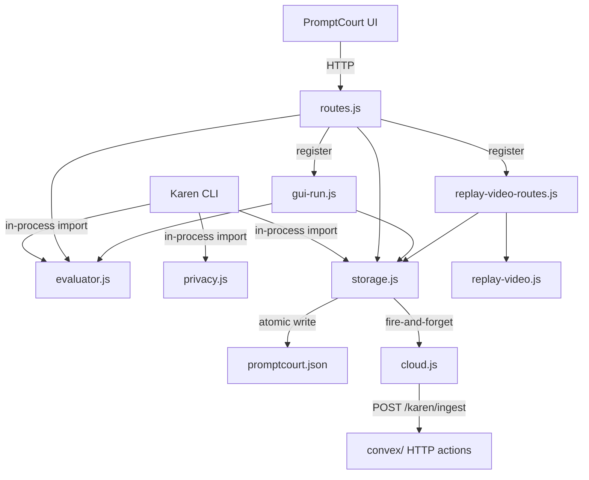

# PromptCourt Server

The server-side policy boundary for Karen. PromptCourt scores prompts, stores verdicts, redacts sensitive data, mirrors records to Convex when configured, and exposes a small HTTP surface that both the Karen CLI and the PromptCourt web UI consume.

## Agent TL;DR

- Eleven focused files, one responsibility each. Keep them that way.
- The evaluator is the source of truth for verdicts. Do not derive verdicts elsewhere.
- Privacy redaction in [`privacy.js`](privacy.js) runs before any value is recorded or shipped to the cloud.
- Cloud sync is fire-and-forget. Storage must succeed locally even when Convex is offline.
- HTTP composition is layered: [`routes.js`](routes.js) is the parent registrar; it calls [`registerGuiRunRoutes`](gui-run.js) and [`registerPromptCourtReplayVideoRoutes`](replay-video-routes.js) so the inherited Express bootstrap only needs `registerPromptCourtRoutes(app, ...)`.
- Browser-launched runs go through the GUI runtime in [`gui-run.js`](gui-run.js), which evaluates first, records locally, and only then queues the run. Replay export is owned by [`replay-video.js`](replay-video.js).
- Quiz building is shared between the CLI and GUI: [`quiz.js`](quiz.js) wraps the AI-backed and parser-fallback question generators; [`quiz-analyzer.js`](quiz-analyzer.js) does the AST-aware diff impact analysis; [`diff-synthesizer.js`](diff-synthesizer.js) generates a plausible diff for GUI runs only when a real model call is available. Karen must not quiz users on fixture/sample diffs.

## Purpose

Encapsulate every server-side decision Karen makes about a prompt: judgment, recording, redaction, cloud mirroring, and HTTP exposure. Anything else in the OpenChamber web server is inherited substrate.

## Files

- [`evaluator.js`](evaluator.js) - prompt scoring. Exports `evaluatePrompt(prompt)` returning `{ score, verdict, allowed, intent, reasons, dimensions, suggestedRewrite }`, plus `extractPromptText(body)` for OpenCode-shaped request bodies. A fast-path classifier short-circuits conversational greetings (`intent='conversational'`) and read-only exploration prompts (`intent='exploration'`) to `approved` without scoring; everything else falls through to the dimensional scorer where score < ~25 (or hopeless without concrete intent) produces `verdict='blocked'`. Reasons explain the charges.
- [`quiz.js`](quiz.js) - shared quiz builder used by the Karen CLI and the GUI runtime. Exports `buildQuiz({ prompt, generatedDiff, onAiFallback? })` (returns `{ source, questions, summary }`) plus the env-driven flags `quizAiAllowed`, `quizModel`, `quizReasoningEffort`, `quizTimeoutMs`. Internally calls `buildAiQuiz` when an OpenAI key is present and `KAREN_QUIZ_AI` is not disabled; falls back to `buildParserQuiz` (deterministic, evidence-driven) on failure or when AI is off. Reads `OPENAI_API_KEY`, `KAREN_QUIZ_MODEL` (default `gpt-5.5-pro`), `KAREN_QUIZ_REASONING_EFFORT`, and `KAREN_QUIZ_TIMEOUT_MS`.
- [`quiz-analyzer.js`](quiz-analyzer.js) - TypeScript-AST-backed diff analyzer. Exports `parseDiff(diff)`, `analyzeQuizEvidence(summary, { cwd })` (aliased as `analyzeDiffImpact`), and helpers (`isTestFile`, `isConfigFile`, `isJavaScriptLikeFile`, `extractSymbols`). Produces test-coverage mapping, exported/changed-symbol sets, call-site detail, and config-impact evidence used by `quiz.js` to build evidence-grounded questions. Lives here (not in `packages/karen/lib/`) so the CLI and GUI quizzes share the same analysis.
- [`diff-synthesizer.js`](diff-synthesizer.js) - GUI-only diff generator. Exports `synthesizeGuiDiff({ prompt })` returning `{ diff, source }`. Calls OpenAI with a system prompt to produce a plausible unified diff for the user's prompt. If no key is present, AI is disabled, the model returns non-diff content, or the call fails, it throws instead of returning a fixture. The Karen CLI does not use this — it operates against real worktree diffs.
- [`storage.js`](storage.js) - local JSON store at `$XDG_CONFIG_HOME/openchamber/promptcourt.json`. Exports `createPromptCourtStore({ openchamberDataDir, cloudSync? })` returning a store with `recordBlockedPrompt`, `recordApprovedPrompt`, `recordQuizResult`, `recordRunEvent`, `getRunEvents`, `cleanupDevRecords`, `getFeed`, `getProfile`, `getOverview`, and `normalizeUsername`. Atomic writes via temp-file rename. Computes derived profile stats (discipline score, level, streaks, rewards).
- [`privacy.js`](privacy.js) - `redactPublicText(value, maxLength)` redacts API keys, tokens, secrets, OpenAI/GitHub key shapes, emails, URLs, and `/Users/...` / `C:\Users\...` paths. Truncates with an ellipsis. Used everywhere a prompt or post excerpt crosses a boundary.
- [`cloud.js`](cloud.js) - Convex sync. Exports `createPromptCourtCloudSync({ env, fetchImpl, loadEnvFiles })` returning `{ enabled, send, recordBlockedPrompt, recordApprovedPrompt, recordQuizResult }`. Reads `KAREN_CLOUD_SYNC`, `CONVEX_HTTP_ACTIONS_URL` (and Vite/site aliases), and `KAREN_CLOUD_INGEST_SECRET`. POSTs JSON to `<endpoint>/karen/ingest` with `Authorization: Bearer <secret>`. Errors are swallowed and only logged when `KAREN_CLOUD_DEBUG=1`.
- [`gui-run.js`](gui-run.js) - browser-initiated guarded-run runtime. Exports `createGuiRunRuntime({ store, evaluate?, runner?, now?, schedule? })` and `registerGuiRunRoutes(app, { express, store, runtime? })`. Tracks an in-memory map of GUI runs (capped at `GUI_RUN_LIMIT=100`, events at `GUI_RUN_EVENT_LIMIT=50`), evaluates the prompt, records blocked/approved into `store`, transitions implementation prompts through `queued -> judging -> running -> building_quiz -> quiz_required` only when an injected runner returns a real diff, completes conversational/exploration prompts without a quiz, and exposes per-run SSE.
- [`live-session.js`](live-session.js) - in-memory pub/sub for short-lived “live session” events (TTL, capped event buffer). Intended for optional real-time Karen session fan-out; wiring to HTTP/SSE may be added incrementally.
- [`replay-video.js`](replay-video.js) - replay-tape video contract + renderers. Exports `REPLAY_VIDEO_SCHEMA_VERSION`, `REPLAY_COMPOSITION_ID`, `buildReplayStepsFromEvents`, `normalizeReplaySteps`, `buildReplayVideoContract`, `createStubReplayRenderer`, `createRemotionReplayRenderer`, `createReplayVideoRenderer`, and `renderReplayVideoExport`. The Remotion renderer is selected when `KAREN_REPLAY_RENDERER=remotion`; otherwise a stub JSON renderer ships a Remotion-ready manifest.
- [`replay-video-routes.js`](replay-video-routes.js) - HTTP wrapper for replay export. Exports `createReplayVideoExportHandler({ store, renderer, outputDir })` and `registerPromptCourtReplayVideoRoutes(app, { express, openchamberDataDir, store, renderer? })`. Output is written under `<openchamberDataDir>/promptcourt-replay-exports/`.
- [`routes.js`](routes.js) - HTTP surface. Exports `registerPromptCourtRoutes(app, { express, openchamberDataDir, buildOpenCodeUrl, getOpenCodeAuthHeaders })` and `evaluatePromptCourtRun({ store, prompt, username })`. Mounts `/api/promptcourt/*`, the guarded `/api/session/:sessionId/prompt_async` proxy, and registers the GUI-run and replay-export routes.

## Contract

HTTP endpoints mounted by [`registerPromptCourtRoutes`](routes.js):

| Method | Path | Purpose |
|---|---|---|
| GET | `/api/promptcourt/feed` | Latest public posts. |
| GET | `/api/promptcourt/profile/:username` | Per-user profile with stats, recent sessions, and posts. |
| GET | `/api/promptcourt/overview` | Leaderboard + totals + feed. |
| GET | `/api/promptcourt/runs` | Run events, optionally filtered by `username`, `since`, `limit`. |
| GET | `/api/promptcourt/runs/events` | Server-Sent Events stream of run events. Heartbeat every 1.5s. |
| POST | `/api/promptcourt/admin/cleanup` | Admin-only smoke/all dev-record cleanup. Auth: `Authorization: Bearer <KAREN_ADMIN_TOKEN \| KAREN_CLOUD_INGEST_SECRET>`. |
| POST | `/api/promptcourt/evaluate` | Evaluate a prompt. Optional `recordBlocked: true` to publish a blocked record. |
| POST | `/api/promptcourt/run` | Evaluate, then open a real terminal window running the Karen CLI. macOS uses Terminal.app, Windows uses PowerShell, Linux uses `$TERMINAL`. |
| POST | `/api/promptcourt/gui-runs` | Queue an in-process guarded GUI run. Returns `{ run }` with `status: 'queued'`; advances asynchronously. |
| GET | `/api/promptcourt/gui-runs` | List recent GUI runs (optional `username`, `limit`). |
| GET | `/api/promptcourt/gui-runs/:runId` | Fetch a single GUI run's public state. |
| GET | `/api/promptcourt/gui-runs/:runId/events` | SSE stream of GUI-run lifecycle events. Heartbeat every 1.5s. |
| POST | `/api/promptcourt/gui-runs/:runId/answer` | Submit a quiz answer. Wrong answers finalize the run as rollback. |
| POST | `/api/promptcourt/gui-runs/:runId/complete` | Finalize a quiz as passed after all answers are correct. |
| POST | `/api/promptcourt/gui-runs/:runId/abandon` | Treat a closed quiz as failed and record rollback. |
| POST | `/api/promptcourt/replay/export` | Build a replay-tape video contract from run events and write it via the configured renderer. |
| POST | `/api/session/:sessionId/prompt_async` | Guarded proxy to OpenCode's prompt_async. Blocks weak prompts (HTTP 422) before forwarding. |

User identity is read from `x-promptcourt-user` header, or `body.username`, or `query.username`, with fallback `local-user`. All usernames are normalized through `store.normalizeUsername`.

Cross-surface imports:

- `evaluator.js` is imported by the Karen CLI ([`../../../../karen/bin/karen.js`](../../../../karen/bin/karen.js)).
- `storage.js` is imported by the Karen CLI for local recording.
- `privacy.js` is imported by the Karen CLI before posting any text to a public record.
- `routes.js` is imported by the inherited OpenChamber server bootstrap to mount Karen routes.

## Data flow



`storage.js` always writes locally first. After a successful write, it calls the cloud sync's `recordX` method, which schedules a background POST. A second `appendRunEvent` is appended only when `cloudSync.enabled` is true, marking the local record as mirrored.

`gui-run.js` is a separate runtime: it does not shell out to a terminal. The browser-launched run is evaluated in-process and, if approved, runs through an injectable `runner` function. Implementation prompts transition to `quiz_required` only when that runner returns a real diff; if no runner or no real diff exists, the run fails instead of showing a fake quiz. Conversational or read-only exploration prompts finish as `completed` because there is no diff to defend.

The full GUI composer uses this same endpoint for non-slash normal-mode prompts. The UI creates the run, redirects to `/karen?run=<id>`, opens the SSE stream, and mounts the Kahoot-style quiz modal when the run reaches `quiz_required`. Slash commands are intentionally excluded so OpenCode command autocomplete and command execution still work.

## Invariants

- **Verdict is owned by `evaluator.js`.** No other file invents or overrides verdicts. Routes and CLI render the result faithfully.
- **Local write succeeds before cloud sync starts.** Cloud sync uses already-stored records as input.
- **Cloud failures never throw.** `cloud.js` catches and logs only when `KAREN_CLOUD_DEBUG=1`. Storage continues regardless.
- **Redaction runs before any cross-boundary write.** Routes call `redactPublicText` before storing posts. The CLI does the same before recording.
- **Atomic writes.** `storage.js` writes to a temp file and renames. Partial-write corruption of `promptcourt.json` is not tolerated.
- **No new HTTP routes outside `routes.js`.** Karen-owned HTTP behavior must live here, not in inherited `packages/web/server/index.js`.
- **Run events are bounded.** `RUN_EVENT_LIMIT` keeps the in-memory + on-disk run-event log capped. SSE consumers are responsible for resuming via `since`.
- **GUI runs are bounded too.** `gui-run.js` enforces `GUI_RUN_LIMIT=100` runs and `GUI_RUN_EVENT_LIMIT=50` events per run. The oldest run is evicted when capacity is reached.
- **Replay export never runs the renderer eagerly.** `replay-video.js` returns a Remotion-ready manifest; selecting `KAREN_REPLAY_RENDERER=remotion` activates the Remotion path but it still throws explicitly if no Karen Remotion bundle is configured. Do not pretend an MP4 exists.

## Change rules

- Adding a new prompt-quality dimension means adding it to `dimensions` in `scorePrompt`, updating `reasons` thresholds, and refreshing the cap math. Update [`evaluator.test.js`](evaluator.test.js) accordingly.
- Adding a new public-post type requires updating both [`storage.js`](storage.js) (`type` discriminator) and Convex (`publicPostValidator` in [`../../../../../convex/karen.ts`](../../../../../convex/karen.ts)).
- New cloud-sync events should mirror the local `recordX` shape and reuse `sessionPayload` / `publicPostPayload` so Convex `ingestEvent` can dedupe via `localSessionId`.
- New environment variables must be documented in [`../../../../../docs/karen/operations/env.md`](../../../../../docs/karen/operations/env.md).
- Do not bypass `redactPublicText`. If a new field needs more lenient redaction, extend `redactPublicText` (or add a sibling) and reference it from the new write path.
- Route handlers in [`routes.js`](routes.js) must use the existing `jsonParser` and `getUsernameFromRequest` helpers; do not introduce per-route auth logic except for admin endpoints (which use `authorizeAdmin`).
- New GUI-run statuses must be added to the runtime in [`gui-run.js`](gui-run.js) and to the SSE event handler in the UI in the same change. Do not let UI infer a new status from heuristics.
- New replay-video step shapes go through `normalizeReplaySteps` in [`replay-video.js`](replay-video.js); preserve `REPLAY_VIDEO_SCHEMA_VERSION` semantics or bump it.
- Touching `/api/session/:sessionId/prompt_async` requires understanding the inherited OpenCode forwarder it wraps; keep the contract identical when not blocked.

## Tests

- [`evaluator.test.js`](evaluator.test.js) - prompt scoring across the dimension matrix, vague-phrase penalty, suggested-rewrite shape.
- [`storage.test.js`](storage.test.js) - local store CRUD, atomic write, profile computation, streak math, cleanup modes.
- [`privacy.test.js`](privacy.test.js) - redaction patterns, truncation, path scrubbing.
- [`cloud.test.js`](cloud.test.js) - env-driven enablement, endpoint normalization, ingest secret header, fire-and-forget error handling.
- [`routes.test.js`](routes.test.js) - HTTP route shapes, blocked vs approved verdicts, terminal launcher fallback paths, admin auth, SSE flushing.
- [`gui-run.test.js`](gui-run.test.js) - GUI-run lifecycle (queued -> judging -> blocked / running -> quiz_required, plus the conversational/exploration `completed` short-circuit and the answer/finalize quiz flow), recording side effects, listener and waiter contracts.
- [`replay-video.test.js`](replay-video.test.js) - replay contract building, step normalization, outcome inference, stub renderer output, Remotion renderer error path.
- [`diff-synthesizer.test.js`](diff-synthesizer.test.js) - synthesizer fallbacks (no API key, empty prompt, model returns non-diff), valid model-produced diff, code-fence stripping.

Run from repo root:

```sh
bun run test:promptcourt
```
